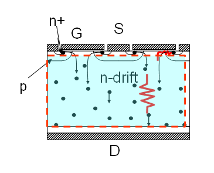
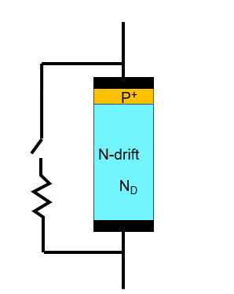
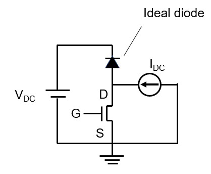
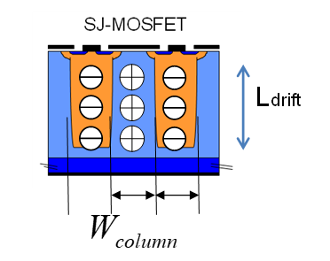
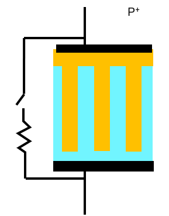
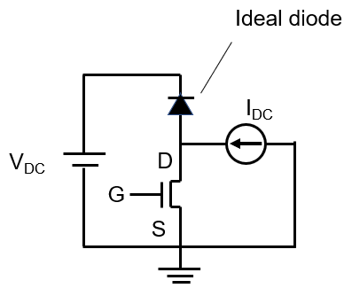

# Power-Semiconductor-Devices
Power Semiconductor Devices final report by Usukhbayar Erdenebat

Given parameters:

    q = 1.6e-19 [C]
    Ɛ = 1.0e-12 [F/cm]
    kT = 0.026 [eV] at 300K
    ni = 1.5e10 [/cm3] at 300K
    Mobility
     hole 500 [cm2/V-sec]
     Electron 1500 [cm2/V-sec]
    1[J] = 1[C] x 1[V]
    1[W] = 1[A] x 1[V]
    1[A] = 1[C] / 1[sec]
    C=dQ/dV
    
    E(critical) = 2e5 [V/cm]
    I_o = 10 [A]
    V_dc = 300 [V]

Question 1

1.  Design doping concentration of N drift region of MOSFET (Fig 1) for VB=700V

*figure 1*

2.  Calculate on resistance of the MOSFET for area of 1 cm2
3.  Calculate Coss (CGD+CDS) as a function of applied voltage (Fig 2)

4.  Calculate turn off (Vds) waveform of the MOSFET under inductive load (Fig. 3). Gate is assumed to be turned off without Miller period (i.e. gate resistance =0)

5.  Calculate turn-off loss (energy)

    
Question 2

1.  Design SJ structure MOSFET (Fig 1) for VB=700V. SJ stripe depletes at 50 V.

2.  Calculate on resistance of the MOSFET for area of 1 cm2
3.  Calculate Coss (CGD+CDS) as a function of applied voltage (Fig 2)

4.  Calculate turn-off (Vds) waveform of the MOSFET under inductive load (Fig. 3). Gate is assumed to be turned off without Miller period (i.e. gate resistance =0)

5.  Calculate turn-off loss (energy)
